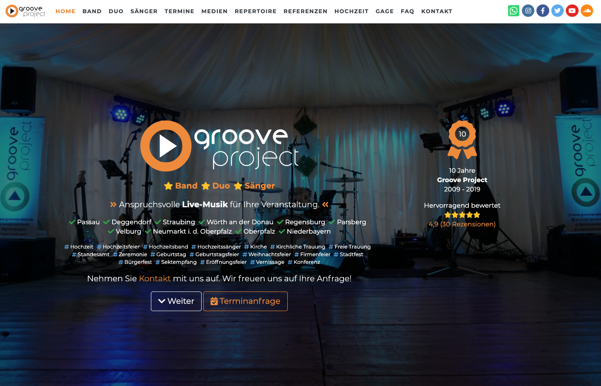
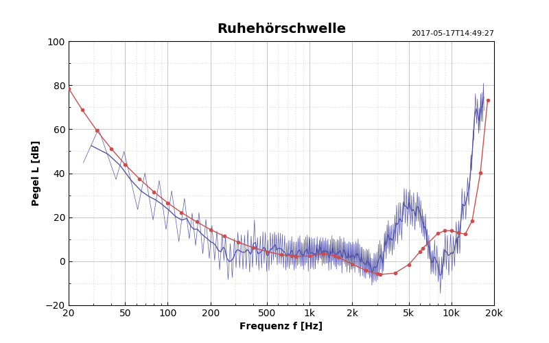
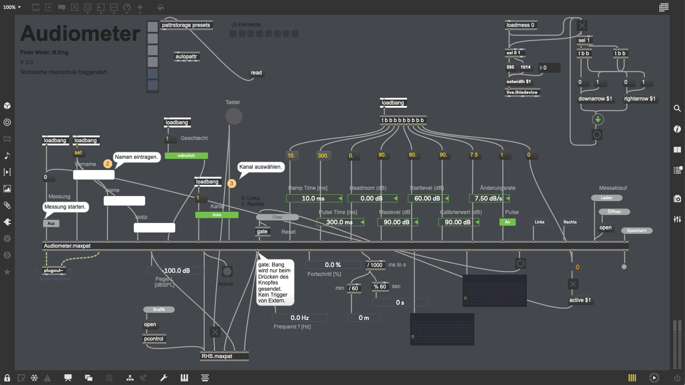
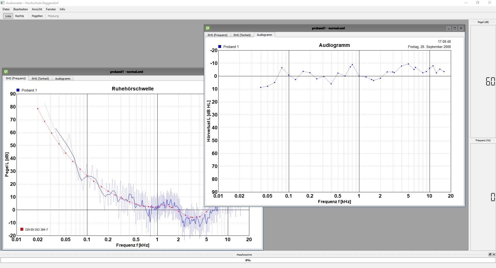
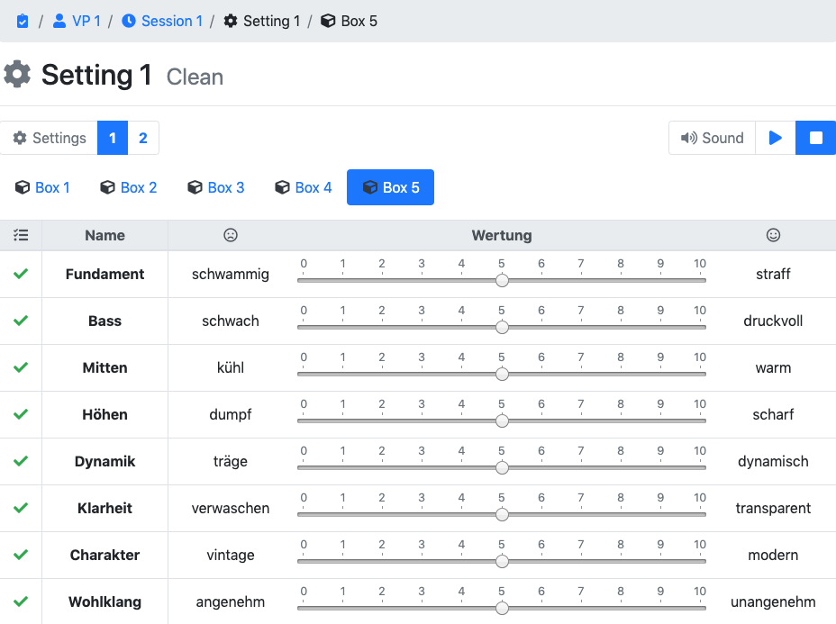
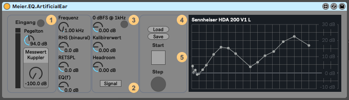
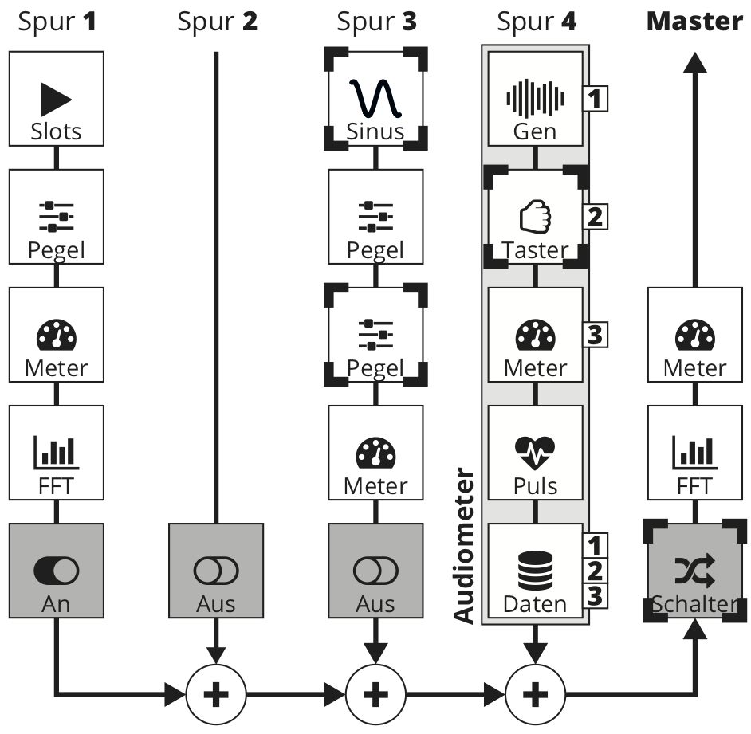

  

    

      
      

        <h1 class="mt-0"><b>P</b>eter <b>M</b>eier<small class="text-muted small">, M.Eng.</small></h1>
        
<b>A</b>udio Engineer, <b>S</b>oftware Developer, <b>M</b>usician

        

          <a href="https://github.com/akustiker" target="_blank"><i class="fab fa-github"></i> GitHub</a> &middot;
          <a href="https://twitter.com/akustiker" target="_blank"><i class="fab fa-twitter"></i> Twitter</a> &middot;
          <a href="mailto:mail@pmeier.de"><i class="fas fa-envelope"></i> E-Mail</a>
        

      

    

  

  

    <h1>Über mich</h1>
    
Informationen zu meiner Person.

    

      

        

          <iframe class="embed-responsive-item" src="https://www.google.com/maps/embed?pb=!1m18!1m12!1m3!1d2626.503357303834!2d12.952403015813228!3d48.82953671069178!2m3!1f0!2f0!3f0!3m2!1i1024!2i768!4f13.1!3m3!1m2!1s0x4775119871ad94ef%3A0x64e9bac6691ed449!2sTechnische%20Hochschule%20Deggendorf!5e0!3m2!1sde!2sde!4v1571303222266!5m2!1sde!2sde"
            width="600" height="450" frameborder="0" style="border:0;" allowfullscreen=""></iframe>
        

        <ul class="list-group list-group-flush">
          <li class="list-group-item">
            <h4 class="card-title"><i class="fas fa-building text-muted"></i> Arbeitsplatz</h4>
            <b>Technische Hochschule Deggendorf</b> 
            Fakultät Elekrotechnik und Medientechnik 
            Dieter-Görlitz-Platz 1 
            94469 Deggendorf 
            <a href="https://www.th-deg.de">www.th-deg.de</a>
          </li>
          <li class="list-group-item">
            <b>Peter Meier</b>, M.Eng. 
            Laboringenieur für Audiotechnik 
            Labor Psychoakustik (J 105) 
            Tel. +49 991 3615-590 
            <a href="mailto:peter.meier@th-deg.de?subject=Feedback">peter.meier@th-deg.de</a>
          </li>
        </ul>
      

      

        

          <h4 class="card-title"><i class="fas fa-list text-muted"></i> CV</h4>
          <h6 class="card-subtitle text-muted">Curriculum Vitae</h6>
        

        <ul class="list-group list-group-flush">
          <li class="list-group-item">
            seit <b>2011</b> 
            Technische Hochschule Deggendorf 
            <i class="fas fa-university text-muted"></i> Lehrauftrag <small class="text-muted">für Beschallungstechnik</small>
          </li>
          <li class="list-group-item">
            seit <b>2008</b> 
            Technische Hochschule Deggendorf 
            <i class="fas fa-headphones text-muted"></i> Laboringenieur <small class="text-muted">für Audiotechnik</small>
          </li>
          <li class="list-group-item">
            <b>2008 - 2011</b> 
            Technische Hochschule Deggendorf 
            <i class="fas fa-graduation-cap text-muted"></i> Master of Engineering <small class="text-muted">mit Auszeichnung</small> 
            Medientechnik <small class="text-muted">Industrielles Multimedia</small>
          </li>
          <li class="list-group-item">
            <b>2006</b> 
            Institut für Rundfunktechnik (IRT) München 
            <i class="fas fa-code text-muted"></i> Praktikum <small class="text-muted">Audio Software Engineering</small>
          </li>
          <li class="list-group-item">
            <b>2004 - 2008</b> 
            Technische Hochschule Deggendorf 
            <i class="fas fa-graduation-cap text-muted"></i> Dipl.-Ing. (FH) <small class="text-muted">mit Auszeichnung</small> 
            Medientechnik <small class="text-muted">Medieninformatik</small>
          </li>
          <li class="list-group-item">
            <b>2004</b> 
            Goethe-Gymnasium Regensburg 
            <i class="fas fa-school text-muted"></i> Abitur <small class="text-muted">LK Mathe/Physik</small>
          </li>
          <li class="list-group-item">
            <b>2000</b> 
            Edith-Stein-Realschule Parsberg 
            <i class="fas fa-school text-muted"></i> Mittlere Reife <small class="text-muted">Musischer Zweig</small>
          </li>
        </ul>
      

      

        

          <h4 class="card-title"><i class="fas fa-chalkboard-teacher text-muted"></i> Lehrtätigkeiten</h4>
          <h6 class="card-subtitle text-muted">Bachelorstudiengang Medientechnik</h6>
        

        <ul class="list-group list-group-flush">
          <li class="list-group-item">
            <b>PLV Beschallungstechnik</b> 
            Praktische Lehrveranstaltung 
            Audiotechnik
            Raumakustik
            Psychoakustik
            Lautsprechertechnik
            Interferenz
            Bühnentechnik
            Soundcheck
            Klangbearbeitung
          </li>
          <li class="list-group-item">
            <b>TTP Psychoakustik</b> 
            Tontechnik Praktikum 
            Psychoakustik
            Isophone
            Lautheit
            Audiometer
          </li>
          <li class="list-group-item">
            <b>Digitale Medien I</b> 
            Praktikum 
            Signalanalyse
            FFT
            Filterung
            Abtastung
            AD/DA Wandlung
          </li>
          <li class="list-group-item">
            <b>Digitale Medien II</b> 
            Praktikum 
            Modulationsverfahren
            Leitungen
            Kabel
          </li>
        </ul>
      

      

        

          <h4 class="card-title mb-0"><i class="fas fa-award text-muted"></i> Auszeichnungen</h4>
        

        <ul class="list-group list-group-flush">
          <li class="list-group-item">
            <b>Oberbürgermeister-Dieter-Görlitz-Preis</b> 
            Stadt Deggendorf <small>(2009)</small> 
            Auszeichnung für Diplomarbeit
          </li>
        </ul>
      

      

        

          <h4 class="card-title mb-0"><i class="far fa-file-alt text-muted"></i> Abschlussarbeiten</h4>
        

        <ul class="list-group list-group-flush">
          <li class="list-group-item">
            <b>Masterarbeit</b> <small class="text-muted">(2011)</small> 
            Technische Hochschule Deggendorf 
            "Implementierung digitaler Audiofilter zur Anwendung in psychoakustischen Hörversuchssystemen."
          </li>
          <li class="list-group-item">
            <b>Diplomarbeit</b> <small class="text-muted">(2008)</small> 
            Technische Hochschule Deggendorf 
            "Optimierte Signalprogrammierung eines Hörschwellenmesssystems mit Verifizierung durch Hörversuche."
          </li>
        </ul>
      

      

        

          <h4 class="card-title mb-0 text-white"><i class="fas fa-star"></i> Interessen</h4>
        

        <ul class="list-group list-group-flush">
          <li class="list-group-item">
            <b>Audio Engineering</b> 
            Audiosignalverarbeitung
            Audioanalyse
            Audiometrie
            Psychoakustik
            Music Processing
            Music Information Retrieval
          </li>
          <li class="list-group-item">
            <b>Software Development</b> 
            Python
            SciPy
            Jupyter
            C++
            Max/MSP
            Git
            zsh
            Docker
          </li>
          <li class="list-group-item">
            <b>Web Development</b> 
            HTML5
            JavaScript
            CSS
            Sass
            Angular
            Bootstrap
            SQL
          </li>
          <li class="list-group-item">
            <b>Musik</b> 
            Gesang
            Schlagzeug
            Gitarre
            Symphonisches Blasorchester
            Big Band
            Kammerchor
            Pop
            Rock
            Jazz
          </li>
        </ul>
      

      

        

          <h4 class="card-title mb-0"><i class="far fa-file-alt text-muted"></i> <a href="/publikationen/">Publikationen</a></h4>
        

        <ul class="list-group list-group-flush">
          <li class="list-group-item">
            P. Meier und G. Krump, “<b>Eine modulare Hörversuchssteuerung auf Basis von Audio-Plugins</b>” in Fortschritte der Akustik - DAGA 2018. München, Germany: Deutsche Gesellschaft für Akustik e.V., März 2018. <a href="https://mygit.th-deg.de/audiotechnik/Meier2018">[Link]</a>
          </li>
        </ul>
      

    

  

  

    <h1>Projekte</h1>
    
Eine Übersicht meiner Projekte.

    

      

        
        

          <h4 class="card-title">grooveproject.de <small class="text-muted">Web App</small></h4>
          
Die Website meiner Band Groove Project.

          HTML5
          CSS
          Sass
          Bootstrap
          Angular
          GitLab CI
          LateX
        

      

      

        
        

          <h4 class="card-title">json2rhs <small class="text-muted">Script</small></h4>
          
Generierung von Audiogrammen und Hörschwellen aus Messdaten im JSON-Format.

          Python
          Matplotlib
          NumPy
          SciPy
        

      

      

        
        

          <h4 class="card-title">Audiometer <small class="text-muted">Plugin</small></h4>
          
Eine Implementierung als Audio-Plugin für Ableton Live.

          Max/MSP
          JavaScript
          Ableton
        

      

      

        
        

          <h4 class="card-title">Audiometer <small class="text-muted">Anwendung</small></h4>
          
Optimierte Signalprogrammierung eines Hörschwellenmesssystems.

          C++
          ASIO
          Qt
          Windows
          Audiosignalverarbeitung
          Echtzeit
          HDA200
          Kopfhörerkalibrierung
        

      

      

        
        

          <h4 class="card-title">Web Semantics <small class="text-muted">Web App</small></h4>
          
A hearing test and database app with semantic differentials written for Django in Python.

          Python
          Django
          SQL
          Database
          Open Sound Control
          User Management
        

      

      

        
        

          <h4 class="card-title">EQ.ArtificialEar <small class="text-muted">Plugin</small></h4>
          
Audio-Plugin für die Kalibrierung von Audiometrie-Kopfhörern an Künstlichen Ohren.

          Max/MSP
          M4L
          Ableton
          EQ
        

      

      

        
        

          <h4 class="card-title">Akustischer Nachton <small class="text-muted">Versuchssteuerung</small></h4>
          
Eine Versuchssteuerung zur Untersuchung des Akustischen Nachtons.

          Max/MSP
          M4L
          Ableton
          EQ
        

      

    

  

